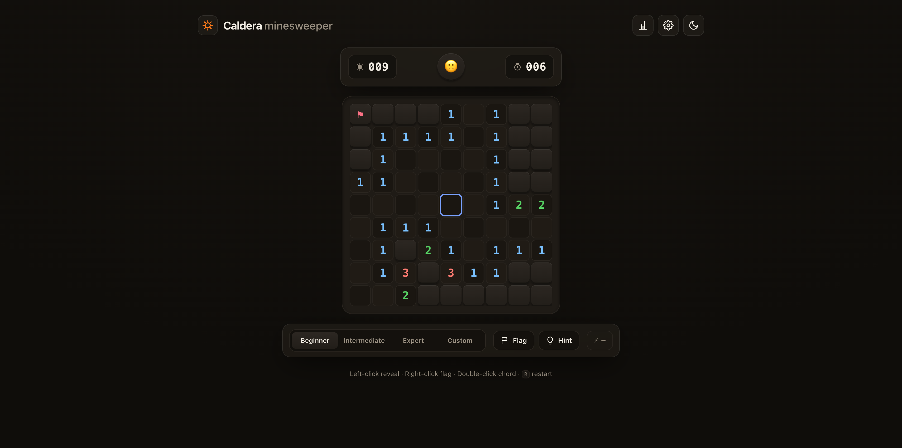

# Caldera · Minesweeper

A modern, customizable, **tactile** Minesweeper for the web. No build step, no
dependencies — just clean HTML, CSS, and ES modules. Fast, offline-capable, and
hostable anywhere static (GitHub Pages included).



## Highlights

- 🎛️ **Fully customizable** — Beginner / Intermediate / Expert presets *and* a
  custom board (width × height × mines) with a live mine-density meter.
- 🛡️ **Guaranteed-safe first click** — mines are placed *after* your first reveal,
  so you never lose on move one (and the first click always opens a region).
- 🧠 **Real game feel** — chording (double-click / middle-click), flagging,
  question marks, a hint solver that only ever reveals *provably* safe cells.
- 🎨 **Premium, tactile UI** — recessed "well", soft-touch keycaps, a molten-amber
  accent that only ignites at moments of tension. Light, Dark, Slate & Classic
  palettes with smooth theme switching.
- ⌨️ **Full keyboard play & accessibility** — arrows/WASD to move, Space reveal,
  `F` flag, `C` chord, `R` restart; ARIA grid, screen-reader cell labels, live
  announcements, and `prefers-reduced-motion` support.
- 📱 **Mobile-ready** — responsive sizing, tap-to-reveal, long-press-to-flag with
  a radial progress ring, haptics, and a tap-to-flag toggle.
- 🏆 **Persistence & leaderboard** — best times, win-rate and streaks per
  difficulty in `localStorage`, automatic resume of an in-progress game, and an
  optional global, name-based **online leaderboard** (Supabase) that gracefully
  degrades to offline when unconfigured.
- ⚡ **Performance-first** — flat typed-array board model, O(changed) DOM updates,
  iterative (never recursive) flood-fill, GPU-only animations.
- 🔌 **Offline / installable** — a tiny service worker precaches everything; add to
  home screen via the web manifest.

## Controls

| Action | Mouse | Touch | Keyboard |
|---|---|---|---|
| Reveal | Left-click | Tap | Space / Enter |
| Flag | Right-click | Long-press | `F` |
| Chord (auto-reveal around a satisfied number) | Double- or middle-click | Double-tap | `C` |
| Move cursor | — | — | Arrows / WASD |
| New game | Click the face | Tap the face | `R` |

## Run locally

ES modules require HTTP (not `file://`). Any static server works:

```bash
python3 -m http.server 8000
# then open http://localhost:8000
```

## Test

Pure game logic has zero DOM dependencies and is covered by Node's built-in test
runner — no install needed:

```bash
node --test
```

## Deploy to Vercel

The repo is Vercel-ready (`vercel.json`). The build step
(`node scripts/build-config.mjs`) injects the public Supabase config from
environment variables into `config.js` at deploy time.

1. **Import** the GitHub repo at <https://vercel.com/new> (Framework preset:
   **Other** — the settings come from `vercel.json`).
2. Add two **Environment Variables** (Project → Settings → Environment
   Variables): `SUPABASE_URL` and `SUPABASE_ANON_KEY`.
3. **Deploy.** Every push to `main` auto-deploys; pull requests get preview URLs.

`.github/workflows/ci.yml` runs the engine tests on every push/PR.

## Online leaderboard (Supabase)

The leaderboard is optional — without it the game runs fully offline using
local best times. To enable the global, name-based leaderboard:

1. Create a project at <https://supabase.com> (free tier is plenty).
2. In **SQL Editor**, run [`scripts/supabase-setup.sql`](scripts/supabase-setup.sql).
   It creates a `scores` table and Row-Level Security policies that let the
   public anon key **read** the board and **insert** a score — nothing else.
3. From **Project Settings → API**, copy the **Project URL** and the **anon
   public** key into the Vercel env vars above (and into `config.js` locally if
   you want to test the leaderboard on `localhost`).

Scores are submitted on a win for the three preset difficulties (assisted runs
and custom boards are excluded). The anon key is a public client key — safe to
ship to the browser; data integrity is enforced by RLS + column checks.

## Architecture

```
index.html            single page; static shell + #board mount + dialogs
styles/
  tokens.css          design tokens & per-theme CSS custom properties
  base.css            reset, typography, reduced-motion
  layout.css          app shell, HUD, toolbar, dialogs
  board.css           the well + keycap/recessed cells + glyphs
  animations.css      GPU keyframes (reveal ripple, flag pop, win wave…)
src/
  board.js            packed bitflag helpers + seeded PRNG
  engine.js           PURE game logic (typed arrays, first-click-safe,
                      iterative flood-fill, chord, win/lose, snapshots)
  render.js           DOM view — build once, mutate only changed cells
  input.js            one delegated pointer + keyboard layer
  timer.js            drift-free ticker + time formatting
  storage.js          localStorage wrapper that never throws
  settings.js         settings model + persistence
  stats.js            best times / win-rate / streaks
  solver.js           constraint deduction for the Hint feature
  confetti.js         one-shot win burst
  leaderboard.js      optional Supabase client (lazy-loaded, RLS-protected)
  ui.js               chrome wiring (HUD, dialogs, theme, overlay)
  main.js             composition root
config.js             runtime config (env-injected at build time)
vercel.json           Vercel build command + headers
scripts/
  build-config.mjs    writes config.js from SUPABASE_* env vars
  supabase-setup.sql  leaderboard schema + Row-Level Security
sw.js                 offline service worker
tests/engine.test.mjs engine unit + fuzz tests
```

### Design notes

The board is two flat `Uint8Array`s indexed by `y*width + x`: one for `0–8`
adjacency counts, one for packed per-cell bitflags (mine / revealed / flagged /
question / exploded / wrong-flag). Win is detected in O(1)
(`revealedCount === width*height − mineCount`). Mine placement uses a partial
Fisher–Yates over the non-excluded cells (no rejection sampling), and the
flood-fill marks cells revealed at enqueue time so the preallocated stack can
never overflow. See [`CONTRAST.md`](CONTRAST.md) for the number-ramp contrast
matrix.

## License

MIT — see [`LICENSE`](LICENSE).
